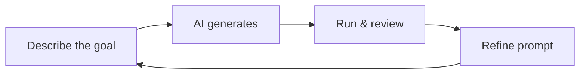

# ✨ VIBE-CODE Frontend Website

[](https://emergent.sh)
[](#-what-is-vibe-coding)
[](#-license)

A clean, responsive frontend website generated with **vibe coding** on **Emergent AI**.

No manual coding needed — describe your idea, iterate with prompts, and ship.

---

## 🚀 What is Vibe Coding?

Vibe coding is a workflow where you describe your product in plain English and AI generates the implementation.

Instead of writing every line yourself, you:

1. Define the outcome
2. Review generated output
3. Refine with follow-up prompts
4. Repeat until it matches your vision

---

## 🔁 The Vibe Loop



---

## 🛠️ Build Your Own Site (Quick Start)

1. Create an account at [emergent.sh](https://emergent.sh)
2. Start a new **Landing Page** or **Web App** project
3. Use a specific prompt (sections, style, behavior)
4. Review preview and iterate with follow-up prompts
5. Export code, push to GitHub, or deploy

### Example Prompt

> Build a responsive portfolio website for a frontend developer. Include a hero section with CTA, about section, 6-card projects grid with hover effects, and contact form. Use a dark theme with purple accents, Inter font, smooth scrolling, and mobile-first layout.

---

## 📁 Project Structure

```text
├── index.html
├── styles.css
├── script.js
├── assets/
└── README.md
```

> 💡 Frontend-only project (no backend/database included).

---

## 🧪 Run Locally

```bash
# Option 1: open index.html directly

# Option 2: start a local server
python -m http.server 8000
# then visit http://localhost:8000
```

---

## 🌍 Deployment Options

- GitHub Pages
- Netlify
- Vercel
- Emergent AI Hosting

---

## 🎯 Prompting Tips

Use prompts that clearly define:

- **Audience**: who the site is for
- **Sections**: what content blocks to include
- **Visual style**: colors, typography, mood
- **Interactions**: animations, hover states, responsiveness

---

## 🤝 Contributing

Fork the repo, improve the project, and open a pull request.

## 📄 License

This project is open source under the **MIT License**.

---

Built with ❤️ using vibe coding + Emergent AI.
