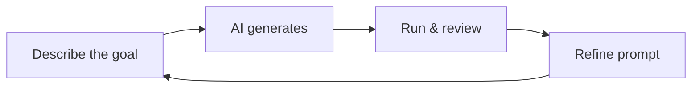

[](https://shopy-animate.preview.emergentagent.com/?utm_source=share)


Frontend Website — Built with Vibe Coding on Emergent AI
A clean, responsive front‑end website generated using vibe coding with Emergent AI. No manual coding required — just describe what you want, and the AI builds it.
# ✨ VIBE-CODE Frontend Website

🚀 What is Vibe Coding?
Vibe coding is a modern approach to software development where you describe your goals in plain English (your “vibe”), and an AI agent generates the actual code for you.
[](https://emergent.sh)
[](#-what-is-vibe-coding)
[](#-license)

Instead of writing syntax, frameworks, or debugging errors, you:
A clean, responsive frontend website generated with **vibe coding** on **Emergent AI**.

Describe what you want in natural language.
No manual coding needed — describe your idea, iterate with prompts, and ship.

Review the AI-generated output.
---

Refine with follow-up prompts until it matches your vision.
## 🚀 What is Vibe Coding?

This project was created using Emergent AI, a browser-based vibe coding platform that turns prompts into working websites and apps.
Vibe coding is a workflow where you describe your product in plain English and AI generates the implementation.

🧠 How Vibe Coding Works (The Loop)
Vibe coding follows a simple, repeatable loop:
Instead of writing every line yourself, you:

Describe the goal
Example: “Build a landing page for a portfolio with a hero section, projects grid, and contact form.”
1. Define the outcome
2. Review generated output
3. Refine with follow-up prompts
4. Repeat until it matches your vision

AI generates the code
Emergent AI reads your prompt and creates a live preview of the site.
---

Run and review
Interact with the preview. Note what’s missing, broken, or off-style.
## 🔁 The Vibe Loop

Refine with feedback
Send follow-up prompts like:


“Make the hero background dark with a gradient.”
---

“Add smooth scroll to sections.”
## 🛠️ Build Your Own Site (Quick Start)

“Use Inter font and increase spacing.”
1. Create an account at [emergent.sh](https://emergent.sh)
2. Start a new **Landing Page** or **Web App** project
3. Use a specific prompt (sections, style, behavior)
4. Review preview and iterate with follow-up prompts
5. Export code, push to GitHub, or deploy

Repeat until satisfied
Keep iterating until the site looks and behaves as intended.
### Example Prompt

Export or deploy
Download the code, push to GitHub, or deploy directly from Emergent.
> Build a responsive portfolio website for a frontend developer. Include a hero section with CTA, about section, 6-card projects grid with hover effects, and contact form. Use a dark theme with purple accents, Inter font, smooth scrolling, and mobile-first layout.
🛠️ How to Build Your Own Site (Step-by-Step)
Follow this workflow to create your own front-end website using Emergent AI:
---

1. Sign Up
Go to https://emergent.sh and create an account.
## 📁 Project Structure

2. Start a New Project
Choose “Landing Page” or “Web App” depending on your goal.
```text
├── index.html
├── styles.css
├── script.js
├── assets/
└── README.md
```

3. Write Your Initial Prompt
Be specific. Example:
> 💡 Frontend-only project (no backend/database included).
“Build a personal portfolio website with a hero section, about me, projects grid with hover effects, and a contact form. Use a modern dark theme with purple accents.”
---

4. Select AI Model & Agent
Pick a model (e.g., Claude, GPT, Gemini) and agent tier (E1, E2, Ultra).
## 🧪 Run Locally

5. Let AI Generate
Wait for Emergent to build the first version with a live preview.
```bash
# Option 1: open index.html directly

6. Test and Refine
Click around the preview.

Send follow-up prompts like:

“Make the navigation sticky.”

“Add a favicon.”

“Improve mobile responsiveness.”

7. Export or Deploy
Download code as a ZIP and open in VS Code.

Push to GitHub directly from Emergent.

Deploy using Emergent’s hosting or connect your own domain.

📁 Project Structure
text
├── index.html        # Main HTML file
├── styles.css        # Custom styles (if any)
├── script.js         # Interactivity (if added)
├── assets/           # Images, icons, fonts
└── README.md         # This file
💡 This is a front-end only project. No backend or database is included.

🎯 Prompting Tips for Better Results
To get the best output from Emergent AI, structure your prompts clearly:

Who is it for?
“A portfolio site for a frontend developer.”

What sections?
“Hero, About, Projects, Contact.”

What style?
“Dark mode, minimalist, purple accent, Inter font.”

What features?
“Smooth scroll, responsive nav, hover effects on project cards.”

Example prompt:

“Build a responsive portfolio website for a frontend developer. Include a hero section with a CTA button, an about section with a photo placeholder, a projects grid with 6 cards and hover effects, and a contact form. Use a dark theme with purple accents, Inter font, and smooth scrolling. Make it mobile-friendly.”

🧪 Run Locally
Clone or download this repo.

Open index.html in your browser.
# Option 2: start a local server
python -m http.server 8000
# then visit http://localhost:8000
```

(Optional) Use a local server:
---

bash
python -m http.server 8000
Then visit http://localhost:8000.
## 🌍 Deployment Options

🌐 Deploy Your Site
You can deploy this site for free using:
- GitHub Pages
- Netlify
- Vercel
- Emergent AI Hosting

GitHub Pages
---

Netlify (drag & drop the folder)
## 🎯 Prompting Tips

Vercel
Use prompts that clearly define:

Emergent AI Hosting (if you built it there)
- **Audience**: who the site is for
- **Sections**: what content blocks to include
- **Visual style**: colors, typography, mood
- **Interactions**: animations, hover states, responsiveness

📚 Learn More About Vibe Coding
What Is Vibe Coding? (Emergent)
---

Vibe Coding vs Traditional Coding
## 🤝 Contributing

Emergent AI Tutorial (YouTube)
Fork the repo, improve the project, and open a pull request.

How To Use Emergent AI (Step-by-Step)
## 📄 License

🤝 Contributing
Want to improve this site? Fork it, make your changes, and submit a pull request!
This project is open source under the **MIT License**.

📄 License
This project is open source and available under the MIT License.
---

Built with ❤️ using Vibe Coding on Emergent AI
No code written manually — just pure prompts and iteration.
Built with ❤️ using vibe coding + Emergent AI.
‎
